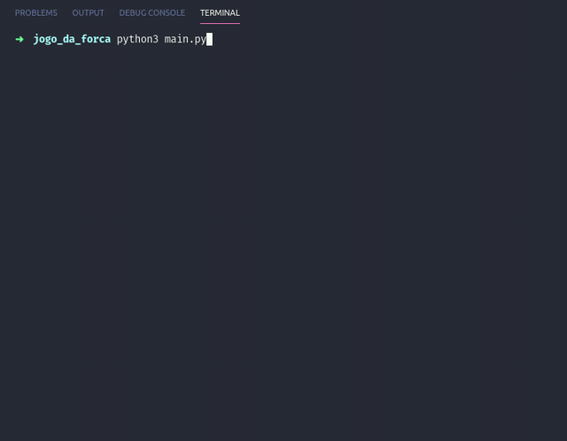

# Jogo da Forca

### Executar
```
python3 com_TAD/main.py
```
ou
```
python3 sem_TAD/main.py
```

### Estrutura de Dados Lista (sem TAD)
- armazenar as palavras
- armazenar o personagem

  #### Algoritmo de ordenação
  - Bubble Sort

### Estrutura de Dados Lista (TAD)
- armazenar personagem
- armazenar palavras chutadas (ordenado)

### Busca
- sequencial
- operadores `in` e `not in`

### Demonstração

